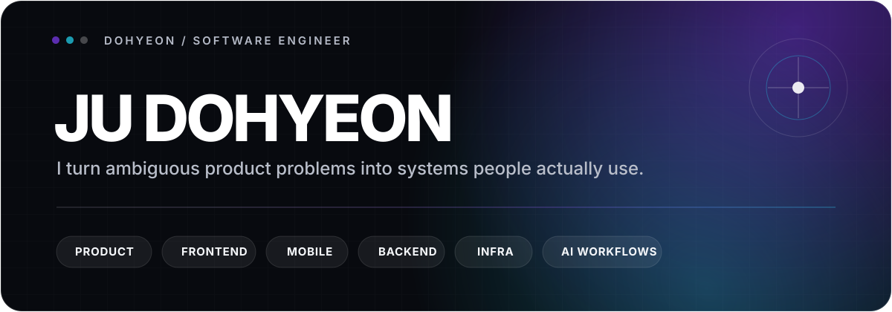
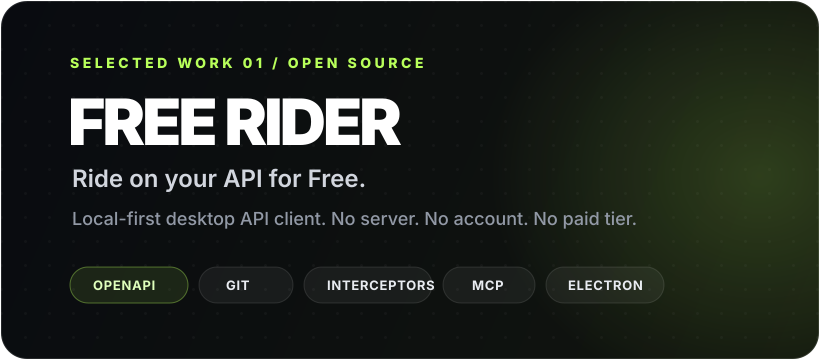
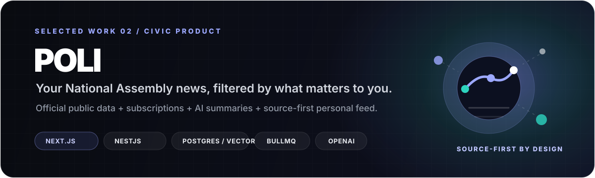

<p align="center">
  
</p>

<p align="center">
  <a href="https://portfolio.dohyeon.kr/">Portfolio</a>&nbsp;&nbsp;·&nbsp;&nbsp;
  <a href="https://blog.dohyeon.kr">Blog</a>&nbsp;&nbsp;·&nbsp;&nbsp;
  <a href="https://www.instagram.com/dev_dohyeon/">Instagram</a>&nbsp;&nbsp;·&nbsp;&nbsp;
  <a href="https://github.com/dohyeon-kr">Open Source</a>
</p>

<br />

## Build the thing that changes the bottleneck.

사람에게 실제로 쓰이는 시스템을 만드는 **Software Engineer**입니다.

시각디자인에서 출발해 Frontend를 가장 오래 다뤘지만, 문제를 해결하는 데 필요하다면 모바일 앱, Backend, Infrastructure, AI workflow까지 경계를 두지 않습니다. 익숙한 기술을 문제에 끼워 맞추기보다 **맥락과 구조를 파악하고 → 병목을 찾고 → 필요한 것을 학습해 만들고 → 관찰하고 → 다음 실행을 위해 축적하는 방식**으로 일합니다.

```text
context → bottleneck → learn → build → observe → accumulate
```

### What I optimize for

- **Context before tools** — 기술보다 먼저 사업, 사용자, 시스템의 구조를 이해합니다.
- **Bottlenecks before features** — 반복되는 문제의 발생 조건 자체를 바꾸는 쪽을 선호합니다.
- **Working software before long debate** — 작은 실체를 빠르게 만들어 가부와 감각을 검증합니다.
- **Observable systems** — 로그, trace, VOC, 실제 사용 데이터를 통해 가설을 확인합니다.
- **Accumulation** — 경험을 코드, 문서, 규칙, 자동화, infrastructure로 남겨 다음 실행 비용을 줄입니다.

<br />

## Selected work

<a href="https://github.com/dohyeon-kr/free-rider">
  
</a>

### Free Rider

서버와 계정 없이 사용하는 **local-first desktop API client**입니다. 공식 기능을 유료 등급으로 잠그지 않는 **All Free** 정책과 AGPL-3.0 오픈소스 모델을 사용합니다.

OpenAPI 명세를 가져와 변경을 검토·선택 반영하고, 환경/변수와 interceptor를 통해 요청 흐름을 제어하며, 컬렉션을 로컬 Git workflow와 연결합니다. MCP를 통해 AI coding agent가 API 작업을 이어받을 수 있는 방향도 함께 확장하고 있습니다.

**Electron · OpenAPI · Git · QuickJS · MCP · VitePress**  
[Repository](https://github.com/dohyeon-kr/free-rider) · [Documentation](https://dohyeon-kr.github.io/free-rider/) · [Releases](https://github.com/dohyeon-kr/free-rider/releases)

<br />

<a href="https://poli.it.kr">
  
</a>

### Poli

**내 관심사로 받아보는 국회 소식.** 대한민국 국회의 공식 공공 데이터를 바탕으로 의원, 정당, 법안, 관심사를 구독하고 필요한 변화를 개인 피드로 모아보는 서비스입니다.

공식 원문과 출처를 중심에 두고, AI는 법안과 활동을 더 빠르게 이해하기 위한 요약과 의미 매칭에 사용합니다. PWA, 정기 수집 worker, pgvector 기반 관심사 후보 검색, 개인화 알림/다이제스트 구조까지 하나의 제품 흐름으로 구성하고 있습니다.

**Next.js · NestJS · PostgreSQL/pgvector · Drizzle · Redis/BullMQ · OpenAI · PWA**  
[Live](https://poli.it.kr)

<br />

## Toolbox

| Product surface | Systems & data | Delivery & observability | AI & automation |
| --- | --- | --- | --- |
| React, Next.js | Node.js, NestJS | AWS, Docker | OpenAI API |
| React Native, Expo | REST, OpenAPI | GitHub Actions, Jenkins | MCP |
| Electron, Storybook | PostgreSQL, SQLite | Nginx, EAS | Claude Code, Codex |
| TanStack Query, Zustand | Redis, BullMQ | OpenTelemetry, SigNoz | Playwright automation |

<br />

## More than code

디자인을 공부하고 제품을 만들면서, 인터페이스와 코드만이 아니라 **사람이 어떻게 이해하고 사용하며 협업하는지**까지 개발의 일부라고 생각하게 됐습니다. 그래서 작업 과정에서 얻은 판단 기준과 실패, 협업 방식, 기술적 맥락을 꾸준히 글로 남깁니다.

**[blog.dohyeon.kr](https://blog.dohyeon.kr)** — 개발, 제품, 협업, 일하는 방식  
**[portfolio.dohyeon.kr](https://portfolio.dohyeon.kr/)** — 프로젝트와 작업 사례  
**[@dev_dohyeon](https://www.instagram.com/dev_dohyeon/)** — 짧은 개발 콘텐츠와 기록

<br />

<p align="center">
  <sub>Design → Software. Frontend-heavy, system-wide.</sub>
</p>
